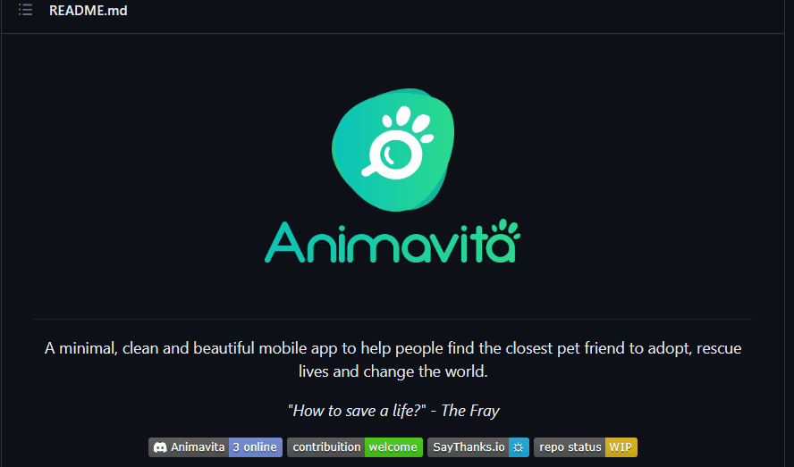

# Projeto com README
Um projeto de teste com um arquivo README
[]

## Tecnologias Utilizadas
- HTML
- CSS
- JS

## Como utilizar

1 - Clone para o projeto
```
git clone <url>
```
2 - Acesse a pasta do projeto
```
cd repositio-com-readme
```